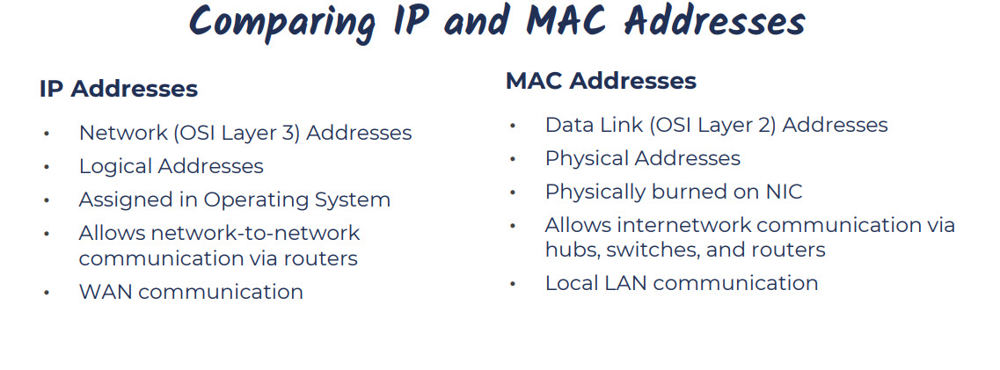

# Computer-Networks

**Difference between IP Address and MAC address**

## Half-Duplex vs Full-Duplex Communication

### Half-Duplex
- **Definition**: Data flows in both directions, but one at a time (e.g., walkie-talkie).
- **Pros**: Simple, cost-effective.
- **Cons**: Slower, turn-based.
- **Examples**: Two-way radios, early Ethernet hubs.

### Full-Duplex
- **Definition**: Data flows in both directions simultaneously (e.g., phone call).
- **Pros**: Faster, efficient for real-time use.
- **Cons**: More complex, costly.
- **Examples**: Modern phones, broadband, Ethernet switches.

| Feature       | Half-Duplex         | Full-Duplex         |
|---------------|---------------------|---------------------|
| **Data Flow** | One way at a time   | Both ways at once   |
| **Speed**     | Slower              | Faster              |
| **Complexity**| Simpler             | More complex        |

